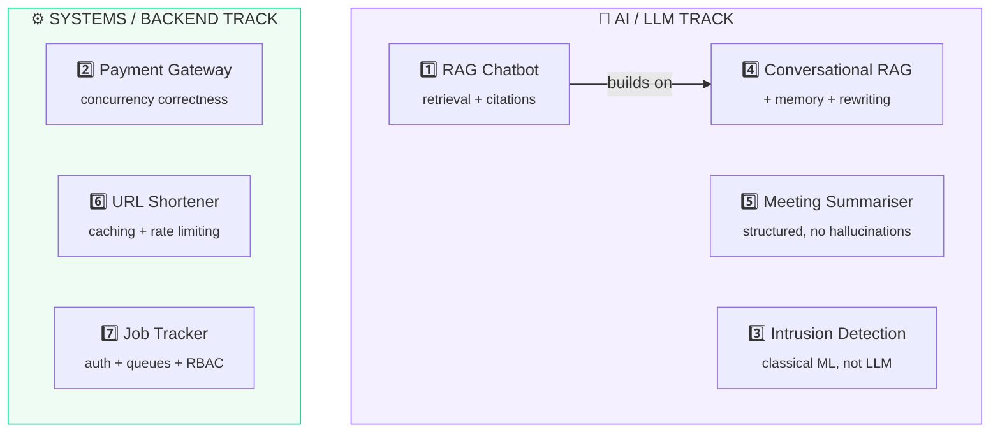
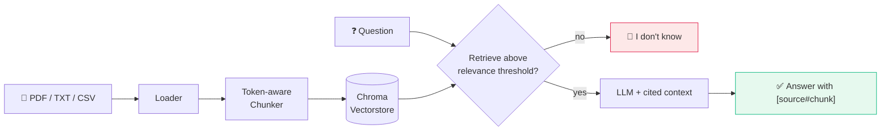
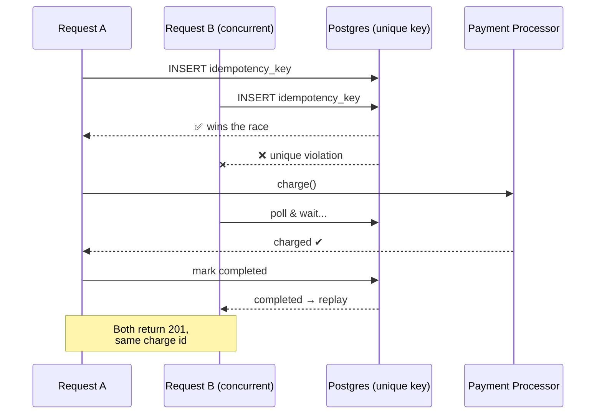
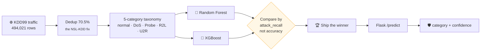
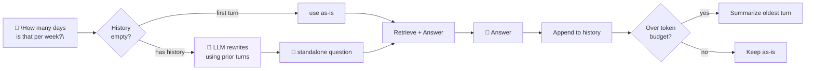
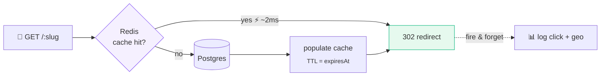
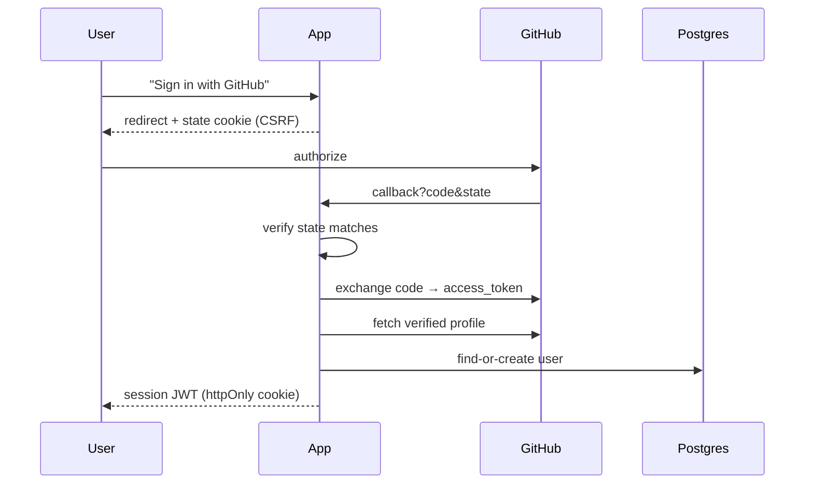
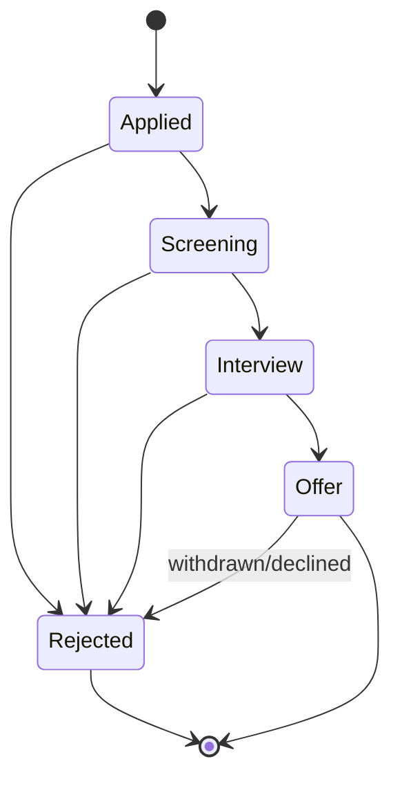

# 🎓 College Capstone Projects

**Seven final-year capstone projects. Zero tutorial skeletons.**

Every line here was actually run: dependencies installed, tests fired at
real Postgres/Redis instances (not mocks), servers booted, APIs hit with
curl, and — where a project needed a real OpenAI/GitHub/Resend credential
this sandbox doesn't have — that gap is named explicitly instead of papered
over. Bugs that were found along the way were fixed, not hidden.

<p align="left">
  
  
  
  
</p>

Clone the whole repo, or copy a single `projects/0N-*` folder out on its
own — each one is fully self-contained.

---

## 🗺️ The map

Two tracks, seven projects. The AI track shares a common RAG core that
gets progressively more sophisticated; the systems track each teaches one
hard, distinct backend lesson.



| # | Project | Stack | Difficulty | Tests |
|---|---------|-------|:----------:|:-----:|
| 1 | [RAG Chatbot](projects/01-rag-chatbot) | Python · LangChain · ChromaDB · OpenAI | 🟢 Beginner→Mid | 16 |
| 2 | [Idempotent Payment Gateway](projects/02-idempotent-payment-gateway) | Node/TS · Express · Prisma · Postgres | 🟠 Mid→Advanced | 9 |
| 3 | [Network Intrusion Detection](projects/03-network-intrusion-detection) | Python · scikit-learn · XGBoost · Flask | 🟡 Mid | 16 |
| 4 | [Conversational RAG](projects/04-conversational-rag) | Python · LangChain · OpenAI | 🟡 Mid | 27 |
| 5 | [Meeting Notes Summariser](projects/05-meeting-notes-summariser) | Python · LangChain · Pydantic · OpenAI | 🟢 Beginner→Mid | 13 |
| 6 | [URL Shortener + Analytics](projects/06-url-shortener-analytics) | Next.js/TS · Prisma · Postgres · Redis | 🟡 Mid | 35 |
| 7 | [Job Application Tracker](projects/07-job-application-tracker) | Next.js/TS · Prisma · Postgres · Redis · BullMQ | 🟠 Mid→Advanced | 58 |

---

## 1️⃣ RAG Chatbot


Upload PDFs/TXT/CSV, ask questions, get answers that **cite the exact
chunk** they came from — or an honest "I don't know" instead of a guess.



**Why it earns a resume line:** RAG is *the* in-demand applied-AI skill
right now, and every interviewer has seen the shallow version. This one
has real answers ready for "why token-based chunking, not characters?" and
"how do you know retrieval quality is any good?" — backed by an eval
script that actually measures hit-rate and answer accuracy, not a vibe.

## 2️⃣ Idempotent Payment Gateway


Fire the same charge request 10 times **simultaneously**. Exactly one
charge happens. Everyone gets the identical response back.



**Why it earns a resume line:** the only pure-backend, non-AI project
here — proof you're more than "did some AI stuff." Idempotency keys and
race-safe writes are a real interview topic at any company touching
payments or webhooks, and this one is *load-tested*: 20 concurrent calls
in, exactly 1 charge out, verified against a real Postgres instance.

## 3️⃣ Network Intrusion Detection System


Classifies live traffic as normal or one of four attack types — and
optimizes for **catching attacks**, not for a misleadingly high accuracy
score.



**Why it earns a resume line:** the one ML project here that isn't
LLM-shaped — shows you can handle tabular data and classical ML, not just
prompt an API. Comes with a real, earned answer to the classic trap
question "your model gets 99% accuracy, is it good?": this one deliberately
optimizes for attack recall instead, and hit **100% recall on the rarest
attack class** in a real run.

## 4️⃣ Conversational RAG


RAG that survives a follow-up question. "How many days is *that* per
week?" gets rewritten to a standalone question **before** it hits
retrieval — the step most "chat with your PDF" projects skip entirely.



**Why it earns a resume line:** nearly every "chat with your docs" resume
bullet is the single-shot version — a bot that correctly resolves a
pronoun is the detail that proves you went past a tutorial. Comes with a
captured, real side-by-side transcript proving the exact failure it fixes,
which is a far stronger interview story than "it supports multi-turn
conversations."

## 5️⃣ Meeting Notes Summariser


Paste a messy transcript, get structured decisions and action items back
— with any field the model couldn't actually confirm **left blank, not
guessed**.

```mermaid
flowchart LR
    T["🎙️ messy transcript<br/><sub>\"um, someone should...\"</sub>"] --> S["LLM + Pydantic schema"]
    S --> O["Summary + Decisions<br/>+ Action Items"]
    O --> D{"Owner/date<br/>stated?"}
    D -->|yes| K["✅ keep value"]
    D -->|no| NL["null — never invented"]
    O --> G["🔍 Grounding check<br/><sub>word-overlap, zero LLM calls</sub>"]
    G -->|mismatch| W["⚠️ flagged for review"]

    style NL fill:#e6f9ee,stroke:#10b981
    style W fill:#fff7e6,stroke:#f59e0b
```

**Why it earns a resume line:** structured extraction from messy text is
one of the *most* commercially deployed LLM patterns — ticket triage,
legal review, CRM notes — more common in real jobs than open-ended chat.
Its best story: a transcript with an action item deliberately left
unassigned, with two named speakers sitting right there as bait, verified
live to come back `owner: null` — a demonstrated answer to "how do you
stop an LLM from making things up," not a claimed one.

## 6️⃣ URL Shortener + Analytics


Short links with click analytics, QR codes, expiration, and rate limiting
— the classic "design a URL shortener" interview question, actually built
and load-tested.



**Why it earns a resume line:** maps almost exactly onto a real system-
design interview question, so you've *built and measured* the thing
people usually only whiteboard. Proof, not claims: **1.9ms** average
cache-hit redirect latency measured live, and 30 concurrent link-creation
requests against a limit of 10 letting through *exactly* 10 — the number
that proves the rate limiter's atomicity, not just "usually correct."

## 7️⃣ Job Application Tracker


Applications move through a real, validated status pipeline with
background email reminders — behind real auth: email/password **and**
"Sign in with GitHub," both built from the actual protocol.





**Why it earns a resume line:** the least flashy idea, the most real
software. The only project here with an OAuth2 flow built step-by-step
against GitHub's actual API (not a library configured to do it
invisibly), a real background job queue for scheduled reminders, and two
independently-tested access-control layers — ownership checks *and* a
role-gated admin view, including a test proving one user genuinely cannot
edit another user's data. The status pipeline is a real state machine with
a full audit trail, which is also what makes its funnel analytics correct.

---

## 🚀 Running any project

```bash
cd projects/0N-project-name

# Python projects
python3 -m venv .venv && source .venv/bin/activate && pip install -r requirements-dev.txt
# Node projects
npm install

cp .env.example .env   # fill in whatever credentials that project needs
pytest   # or: npm test
```

Projects using Postgres/Redis (**2**, **6**, **7**) ship a
`docker-compose.yml` — `docker compose up -d` and you have a working
database with nothing installed locally.

## 📄 License

MIT — see [LICENSE](LICENSE).
